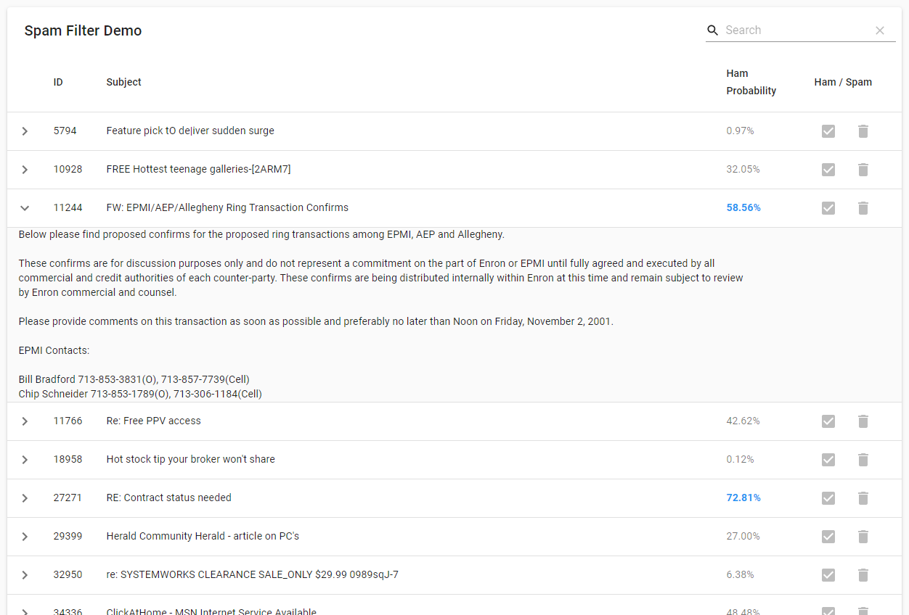
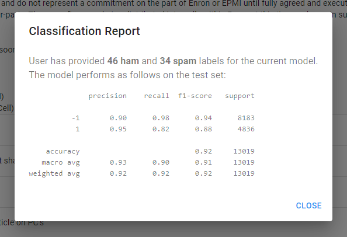

# Spam filtering with Vowpal Wabbit

This repository includes the backend code and a prototype frontend UI for performing active spam filter training using Vowpal Wabbit via a REST API.

## Setup

### Backend dependencies

CherryPy for the backend server, Scikit-learn for utility functions, Vowpal Wabbit for the actual model.

```
conda install cherrypy scikit-learn
```

```
pip install vowpalwabbit
```

### Frontend dependencies

Yarn to manage frontend dependencies, Node.js (https://nodejs.org/en/).

- Install Node.js (https://nodejs.org/en/)
- Install yarn: `npm install -g yarn`
- Build the front-end dependencies:
  ```
  cd frontend-ui-prototype
  yarn
  yarn build
  ```

## Data

A pre-processed copy of the Enron-Spam data (http://nlp.cs.aueb.gr/software_and_datasets/Enron-Spam/index.html) has been included in the repo.

To minimise reliance on external dependencies, all the backend data is pickled to the files in `ui_prototype/data`, although a proper DB/storage mechanism can be substituted in in production.

- `all_ham.pkl`: Pickled List of all the ham messages in the dataset. Each item in the List is a Dict with keys `subject` and `content`.

- `all_spam.pkl`: Pickled List of all the spam messages in the dataset. Same structure as above.

- `train_docs.pkl`, `test_docs.pkl`: Shuffled Lists containing a mix of ham and spam documents, same structure as above.

- `train_labels.pkl`, `test_labels.pkl`: Lists of labels corresponding to the train/test documents -- `1` for ham messages, `-1` for spam messages.

- `user_labels.pkl`: Dictionary of labels provided by users for the training documents via the backend API. Maps `train_docs index` -> `label`.

Text cleaning and data munging functions are provided by `util/text.py`.

## Configuration

Some server configuration options are listed at the top of `server.py`.  More advanced Vowpal Wabbit configuration options are in `ui_prototype/conf.py`.

## Running the Server

**_N.B.: If the server will not be running at http://localhost:4000, the `API_HOST` variable in `frontend-ui-prototype/src/conf.js` will need to be changed and the frontend will need to be rebuilt with `yarn build`._**  

After the frontend dependencies are built, just run `server.py` -- It will serve both the backend API and the prototype frontend UI at the same time.

```
python server.py
```

The prototype UI loads 10 emails at a time at random for easy testing, but in production a more robust display/search system for displaying all the emails at once can be substituted in.

With the default settings, the UI can now be accessed at http://localhost:4000.

## API

The REST API is relatively simple:

- `GET {API_HOST}/email/`: Retrieves 10 random emails
- `GET {API_HOST}/email/{email_id}`: Retrieves an individual email


- `GET {API_HOST}/email/{email_id}/label`: Retrieves the label for an individual email
- `PUT {API_HOST}/email/{email_id}/label`: Sets the label for an individual email


- `GET {API_HOST}/email/{email_id}/prediction`: Retrieves the Vowpal Wabbit prediction for an individual email (returns the probability of the email being ham as a float)


- `GET {API_HOST}/report/`: Retrieves the classification report of the current model on the test set

## Screenshots



